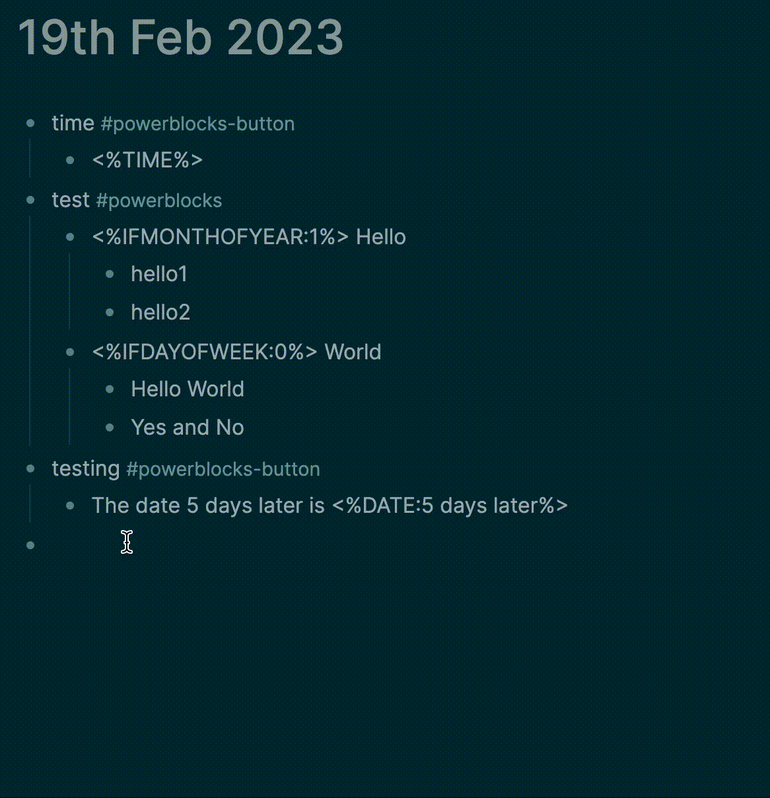

> Sponsor this project on [Github](https://github.com/sponsors/hkgnp) or [get me a coffee](https://www.buymeacoffee.com/hkgnp.dev) if you like this plugin!

# Overview

This plugin was created as I had some unique workflows that Logseq templates were not able to support. It allows the creation of 2 types of "PowerBlocks":

1. Button templates
2. Normal templates

Button templates allow the adding of templates using a button, while normal templates work like regular templates. A list of supported syntaxes can be found below.

_Note: This plugin is still in alpha stage and will not be accepting any PRs. Please include any feature request as a Github issue._



# Instructions

## Creating the PowerBlocks

1. From anywhere in Logseq, create a block like the below. `#powerblocks` and `#powerblocks-button` cannot be changed.

```markdown
### To create a button template

- Buy milk #powerblocks-button
  - Today is <%DATE:5 days later%>

### To create a normal template

- testing #powerblocks
  - Today is <%DATE:5 days later%>
```

2. The syntaxes currently available can be found in the next section.

## Using the PowerBlocks

1. Trigger the PowerBlocks menu by typing `/Insert PowerBlock`
2. Select either a button template (⏺ ) or a normal template (📃) that you have created.
3. Button templates can be used within a Logseq template if you prefer..

# Syntaxes (General)

Below is the list of available syntaxes. I may consider adding to the list, but as I am not sure how useful anyone will find this plugin, it is likely only syntaxes I use will be added.

- `<%PB:time%>`
  Inserts a powerblock in your template, e.g. "time". This only works for buttons.

- `<%DATE:next tuesday%>`
  In this example, if the template is used on a journal page, it will be relative to the journal day. But if used on a page, it will be relative to today.

- `<%DAY%>`
  This simply replaces the syntax with the current day.

- `<%TIME%>`
  This simply replaces the syntax with the current time.

- `<%TIMEAMPM%>`
  This adds in time but in AM/PM format.

- `<%YEAR%>`
  This simply replaces the syntax with the current year.

- `<%INPUT:How are you feeling today?%>`
  When including this syntax in a block, there will be an input where the placeholder will appear in the prompt. After submitting it, the values will be added to your template.

- `<%RANDOMTAG:quotes%>`
  Use this syntax to get a random block that is tagged. In the above example, it will return a random block that is tagged with "quotes", or belongs to a page called "quotes".

- `<$CURRENTPAGENAME%>`
  Get the name of the page that this syntax is being used at.

- `<$CURRENTPAGEURL%>`
  Get the Logseq URL of the page that this syntax is being used at.

- `<%WEEKSSINCEDATE:28 Feb 1990%>`
  Get the number of weeks since a specific date (accepts NLP). For the above example, the syntax will return the number of calendar weeks since the 28th of February, 1990.

- `<%SIDEBAROPEN:uuid%>`
  If your template or button contains this syntax, the right sidebar will immediately open with the indicated block.

# Syntaxes (CONDITIONAL)

Below is the list of syntaxes that rely on conditions specified. Blocks with the conditions will only appear if it matches the parameters.

- `<%IFDAYOFWEEK:1"%>`
  Block containing this syntax will only be added if the day of the week matches the day indicated. 0 is Sunday, 1 is Monday and so on. If you would like the block to be added on multiple days, simply add the values separated by `,`, e.g. `<%IFDAYOFWEEK:1,2,4%>`.

- `<%IFMONTHOFYEAR:2%>`
  Block containing this syntax will only be added if the month of the year matches the month indicated. 0 is January, 1 is February and so on. If you would like the block to be added on multiple days, simply add the values separated by `,`, e.g. `<%IFMONTHOFYEAR:1,2,4%>`.

- `<%IFYEAR:2023%>`
  Block containing this syntax will only be added if the year matches the year indicated.. If you would like the block to be added on multiple days, simply add the values separated by `,`, e.g. `<%YEAR:2022,2023%>`.

- `<%IFDATE:tomorrow%>`
  Block containing this syntax will only be added if the date mentioned in the block matches the current date.

### AND / OR Conditions

You can use AND OR conditions with the above conditional syntaxes. Below are some examples on how you can use it.

- `<%AND <%IFDAYOFWEEK:2%> <%IFMONTHOFYEAR:0%> %> Hello World`
  With the above block, `Hello World` will only be inserted every Tuesday of January.

- `<%OR <%IFDAYOFWEEK:1%> <%IFDAYOFWEEK:5%> %> Hello World`
  With the above block, `Hello World` will be rendered every Tuesday and every Friday.

# Credits

Big shoutout to [David Vargas](https://twitter.com/dvargas92495?ref_src=twsrc%5Egoogle%7Ctwcamp%5Eserp%7Ctwgr%5Eauthor) and the work he has done for Roam's Smart Blocks. Also thanks to [R.J. Nestor](https://twitter.com/rjnestor) for his sharing on how he used Smart Blocks and for inspiring me to do the same in Logseq.

Once again, [chrono-node](https://github.com/wanasit/chrono) for supplying the date parser.
